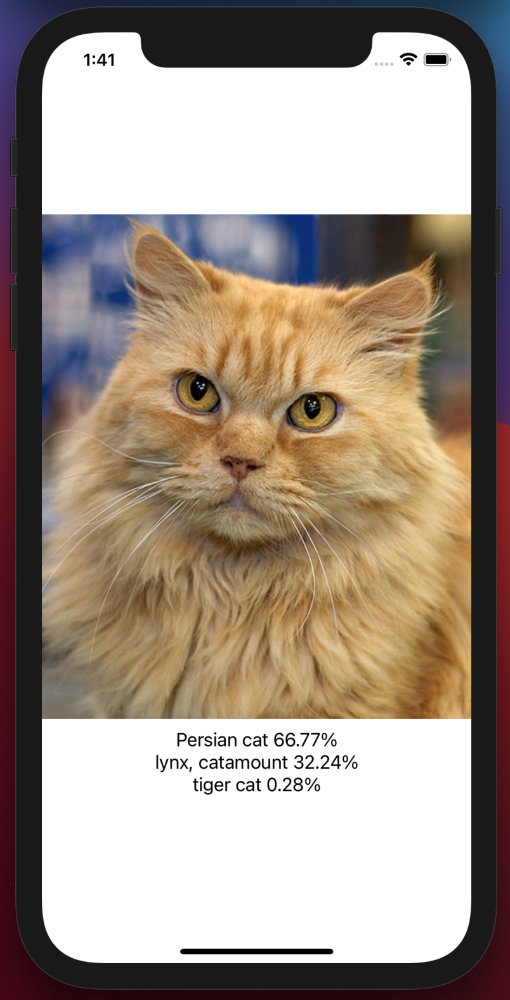
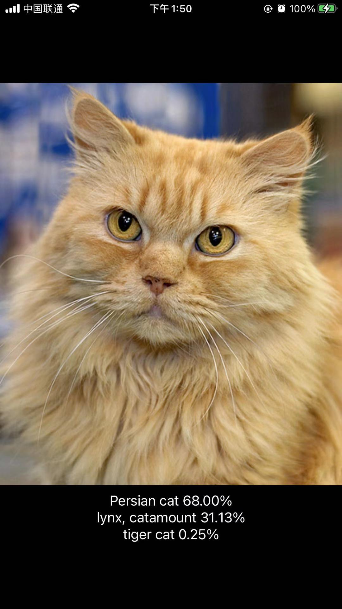
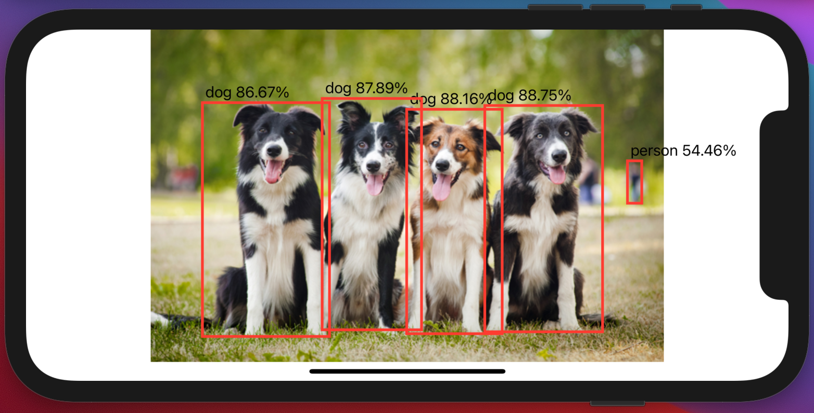

# ncnn-swift

Examples on using ncnn with Swift.

[ncnn](https://github.com/Tencent/ncnn) is a really popular neural network inference framework optimzied for mobile platforms. Sadly, as for now there are few iOS examples and the existing ones (e.g. [dangbo/ncnn-mobile](https://github.com/dangbo/ncnn-mobile), [cmdbug/YOLOv5_NCNN](https://github.com/cmdbug/YOLOv5_NCNN)) are mainly in Objective-C.  In fact, Swift has gradually grown as the major prgramming language for iOS. As Apple releasing SwiftUI, a pure Swift UI framework, in WWDC2019, we could believe that most iOS developers will shift to Swift. Therefore, it is important for a mobile inference framework to support Swift.

And here we are. This project is include examples on how to connect ncnn framework with Swift.

## SqueezenetSwift

  
  
  
Screenshots from simulator and an iPhone 8plus. SwiftUI helps the app adapt to dark mode automatically.

This is a simple image classification with squeezenet from [nihui](https://github.com/nihui)/[ncnn-android-squeezenet](https://github.com/nihui/ncnn-android-squeezenet). I used bridge header to connect C++ and Swift. For an introduction of bridge header, please check this [nice blog](https://medium.com/@anuragajwani/how-to-consume-c-code-in-swift-b4d64a04e989).

## Yolov5Swift

  
  
Screenshots an iPhone 8plus.

This is a simple object detection example with yolov5 from [nihui](https://github.com/nihui)/[ncnn-android-yolov5](https://github.com/nihui/ncnn-android-yolov5). It provides some ideas on how to register custom layer with Swift and how to use [nihui](https://github.com/nihui)/[opencv-mobile](https://github.com/nihui/opencv-mobile) together with ncnn.

Notice that the time shown includes  `cv::imread` (around 40 ms) and the image is resized so that the longer edge is 640.

---

If you have any question on this project, please feel free to file an issue or PR.
